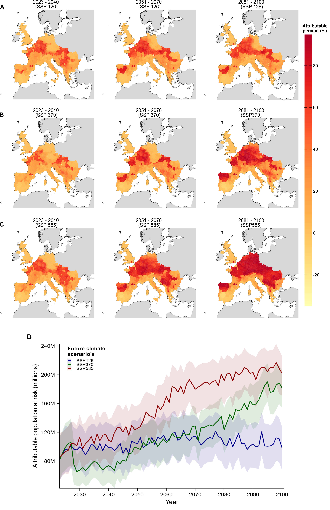

# Climate change attribution of *Aedes albopictus* expansion and arboviral outbreak risk in Europe

This repository contains the data-processing, modelling, climate-attribution, validation, sensitivity-analysis and visualization code accompanying:

**Singh, P., Semenza, J. C., Wallin, J., Fransson, P., Heidecke, J., Frieler, K., Dafka, S. & Rocklöv, J.**  
**“Climate Change Drives the Expansion and Arboviral Outbreak Risk of *Aedes albopictus* in Europe”**  
(Under review at *Nature Microbiology*).

**Status:** Publication details and DOI will be added following publication.

The study quantifies the contribution of observed and projected climate change to the establishment and expansion of *Aedes albopictus* across Europe using a Bayesian spatio-temporal model and matched factual–counterfactual climate simulations. The framework further evaluates future climate-change-attributable population exposure and links projected vector establishment to the post-establishment hazard of dengue and chikungunya outbreaks.

<p align="center">
  
</p>

<p align="center">
  <em>Progression of climate-change-attributable invasion and population exposure for Ae. albopictus, across three emissions pathways and time periods (2023-2100) (Main Fig. 3).</em>
</p>

---

## Repository contents

The repository is organized into the following main directories:

```text
anthro-albo-cc/
│
├── Climate_data_extraction/
│
├── Covariates_processing_and_plotting/
│
├── Data/
│   ├── Historical_climate_socioenvironmental_data/
│   └── Future_climate_socioenvironmental_data/
│
├── Functions/
│
├── Model_Scripts/
│
├── Plotting/
│
├── Results/
│   ├── Plots/
│   │   └── Supplementary_plots/
│   └── Tables/
│
├── LICENSE.md
└── README.md
```
### `Climate_data_extraction/`

Contains scripts for extracting the original gridded climatic, population and land-use datasets used in the study. The directory includes scripts for:

- historical factual climate from ISIMIP3a 20CRv3–ERA5 `obsclim`;
- historical counterfactual climate from ISIMIP3a `counterclim`;
- historical population and land use; and
- future ISIMIP3b climate, population and land-use data.

### `Covariates_processing_and_plotting/`

Contains scripts used to transform extracted data into NUTS3-level model covariates.The main components are:

```text
Climate_and_socio-economic_covariates/
Covariates_binning/
Proximity_covariate/
```
These scripts construct the seasonal climate variables, population density, land-use variables, human-mobility flux, future delta-aligned climate series, proximity covariate and covariate bins required by the establishment model.

### `Data/`

Contains processed climate and socio-environmental datasets generated after the extraction and processing stages. These files are provided so that users who do not need to reproduce the complete raw-data extraction workflow can begin from the processed covariates.

### `Functions/`

Contains reusable R functions used throughout the modelling and prediction workflow, including functions for:

- INLA model construction;
- SPDE implementation;
- matrix operations;
- spatial networks;
- proximity calculations;
- covariate binning;
- posterior prediction; and
- visualization.

### `Model_Scripts/`

Contains the principal model-fitting, prediction and validation scripts:

```text
run_full_analysis_factual.R
run_pred_counterfactual.R
run_pred_future.R
Spatio_tempo_CV.R
```

### `Plotting/`

Contains the final posterior aggregation and figure-generation workflow:

```text
Plotting_final_main_supp_figures.R
```

### `Results/`

Contains figure and table outputs corresponding to the manuscript and Supplementary Information. Main-text figures are available in:

```text
Results/Plots/
```

and Supplementary figures are available in:

```text
Results/Plots/Supplementary_plots/
```

---


## Data availability and access summary

| Data component | Original source | Access |
|---|---|---|
| *Ae. albopictus* surveillance | European Centre for Disease Prevention and Control(ECDC) VectorNet | Data access is restricted under the ECDC data-sharing agreement. Further details are provided in the accompanying manuscript. |
| Historical factual climate | ISIMIP3a 20CRv3–ERA5 `obsclim` | [ISIMIP](https://data.isimip.org/) |
| Historical counterfactual climate | ISIMIP3a 20CRv3–ERA5 `counterclim` | [ISIMIP](https://data.isimip.org/) |
| Future SSP climate | ISIMIP3b bias-adjusted CMIP6 | [ISIMIP](https://data.isimip.org/) |
| Future piControl climate | ISIMIP3b / CMIP6 | [ISIMIP](https://data.isimip.org/) |
| Historical population | GlobPOP | [Zenodo](https://zenodo.org/records/11179644) |
| Future population | SSP/ISIMIP population projections | [ISIMIP](https://data.isimip.org/) |
| Historical and future land use | LUH2 | [LUH2](https://luh.umd.edu/data.shtml) |
| NUTS3 boundaries | Eurostat | [Eurostat NUTS](https://ec.europa.eu/eurostat/web/nuts) |


### Historical and Future climate

Historical factual climate data were obtained from the **Inter-Sectoral Impact Model Intercomparison Project phase 3a (ISIMIP3a)** using the 20CRv3–ERA5 `obsclim` experiment. The climatic variables used were:

```text
near-surface air temperature
total precipitation
near-surface relative humidity
```

Future climate projections were obtained from the bias-adjusted **ISIMIP3b CMIP6 climate forcing dataset**. The analysis uses five CMIP6 climate-model forcings:

```text
GFDL-ESM4
IPSL-CM6A-LR
MPI-ESM1-2-HR
MRI-ESM2-0
UKESM1-0-LL
```

An unweighted multi-model ensemble mean was constructed for:

```text
SSP1-2.6
SSP3-7.0
SSP5-8.5
piControl
```

### NUTS3 spatial boundaries

NUTS3 administrative regions were used as the spatial unit of analysis throughout the study. The Nomenclature of Territorial Units for Statistics (NUTS) classification and spatial boundary data can be accessed from Eurostat:

- [Eurostat NUTS classification and spatial data](https://ec.europa.eu/eurostat/web/nuts)

The analysis harmonizes historical surveillance information to a common NUTS3 regional representation before model fitting.

### Processed data

To facilitate reproduction without repeating the computationally intensive raw-data extraction and preprocessing stages, the repository (`Data/`) provides the final processed climatic and socio-environmental covariates used immediately before model-data assembly and covariate binning. These files are derived from the original open datasets described above and are provided to enable users to reproduce downstream analyses without downloading and processing the complete original gridded climate, population and land-use archives.

---

## Computational considerations

The full analysis is computationally intensive. The main computational requirements arise from:

- fitting the Bayesian spatio-temporal INLA model;
- repeatedly refitting the model for structured cross-validation;
- generating approximately 1,000 posterior prediction draws;
- predicting every NUTS3 region annually through 2100;
- recursively updating the proximity process; and
- generating separate factual and counterfactual predictions for multiple future scenarios.

Future posterior-prediction objects can therefore become large. For machines with limited memory, future scenarios should be processed sequentially and large posterior objects should be reduced to the required posterior summaries before subsequent objects are loaded. A high-memory workstation or HPC environment is recommended for complete reproduction of the full future and sensitivity-analysis workflow.

### Local path configuration
The scripts were developed within the original local analysis directory and therefore retain some local absolute paths and working-directory statements. For example, some scripts contain paths of the form:
```r
setwd(".../VectorNet_ 2_original")
```
These must be replaced with the location of the cloned repository or associated local analysis directory on the user's computer. Similarly, several model scripts source helper functions using their file names only, for example:
```r
source("functions_general.R")
```
The helper functions are stored in:

```text
Functions/
```
Users should therefore either update these source paths to include the directory, or otherwise configure the working directory so that the corresponding helper files can be found. The same principle applies to input and output paths specified within individual scripts. The computational logic is unaffected by these machine-specific path settings, but the paths must be adapted to the local filesystem before execution.

---

## Script execution order

### 1. Raw climate and socio-environmental extraction

For complete reproduction, begin with:
```text
Climate_data_extraction/
```

Historical factual climate:
```text
ISIMIP3a_20CrV3-ERA5_factual/
```

Historical counterfactual climate:

```text
ISIMIP3a_20CRv3-ERA5_counterfactual/
```

Historical population and land use:

```text
Historical_socio-environmental/
```

Future climate, population and land use:

```text
ISIMIP3b_Future_data_extraction/
```

Users beginning from already processed files supplied in `Data/` can skip this stage.


### 2. Construct historical and future covariates

Run the scripts under:

```text
Covariates_processing_and_plotting/
└── Climate_and_socio-economic_covariates/
```
The main scripts construct:

```text
historical and future climate covariates
historical and future population covariates
historical and future land-use covariates
historical and future mobility covariates
```

The future climate alignment is implemented under:
```text
Climate_and_socio-economic_covariates/Delta_method/
```
Users starting with the processed datasets in `Data/` can skip the corresponding climate and socio-environmental processing steps.


### 3. Construct the proximity covariate

Run the proximity workflow under:

```text
Covariates_processing_and_plotting/Proximity_covariate/
```

### 4. Assemble and bin covariates

Run:

```text
Covariates_processing_and_plotting/Covariates_binning/
```

The processed files supplied under `Data/` are intended to allow users to begin reproduction close to this stage rather than repeating the original gridded-data extraction workflow.


### 5. Fit the factual establishment model

Run:

```text
Model_Scripts/run_full_analysis_factual.R
```

This script:

- loads the historical invasion and covariate data;
- constructs the model matrices and latent spatial components;
- fits the Bayesian spatio-temporal establishment model using INLA;
- estimates climatic and socio-environmental effects; and
- generates posterior factual establishment predictions.

### 6. Historical counterfactual prediction

Run:
```text
Model_Scripts/run_pred_counterfactual.R
```

### 7. Future prediction

Run:

```text
Model_Scripts/run_pred_future.R
```

The future-prediction script is used for the different factual SSP and piControl climate configurations. The principal matched projections are:
| Factual climate | Socio-environmental trajectory | Counterfactual climate |
|---|---|---|
| SSP1-2.6 | SSP1 | piControl |
| SSP3-7.0 | SSP3 | piControl |
| SSP5-8.5 | SSP5 | piControl |

---

## Model validation

Structured out-of-sample validation is implemented using:
```text
Model_Scripts/Spatio_tempo_CV.R
```
The study evaluates predictive generalization using complementary designs. Further details are available in the accompanying manuscript.

### Socio-environmental sensitivity analyses

Additional scenario-based sensitivity analyses evaluate whether the projected climate-change-attributable contribution depends on the assumed future socio-environmental background. Further details are provided in the accompanying manuscript. These sensitivity analyses can be implemented directly using `Model_Scripts/run_full_analysis_factual.R`.

---

## Post-establishment outbreak hazard, Figures and results

The establishment projections are linked to an independently estimated European time-to-event relationship between mean summer temperature and post-establishment dengue and chikungunya outbreak hazard. The integrated outbreak risk index combines:

```text
climate-sensitive Ae. albopictus establishment
+
additional post-establishment outbreak hazard associated with factual warming
```
The index is evaluated separately across posterior establishment draws so that establishment-model uncertainty is propagated into the integrated risk summaries. Final post-establishment outbreak hazard estimation, aggregation of results reported throughout the manuscript, and generation of the main and supplementary figures are performed using `Plotting/Plotting_final_main_supp_figures.R`.

---

# Citation
If using this repository, please cite the accompanying manuscript:

**Singh, P., Semenza, J. C., Wallin, J., Fransson, P., Heidecke, J., Frieler, K., Dafka, S. & Rocklöv, J.**  
**“Climate Change Drives the Expansion and Arboviral Outbreak Risk of *Aedes albopictus* in Europe”**  
(Under review at *Nature Microbiology*).

**Status:** Publication details and DOI will be added following publication.

---

## License

The code in this repository is distributed under the terms specified in:
```text
LICENSE.md
```

---
